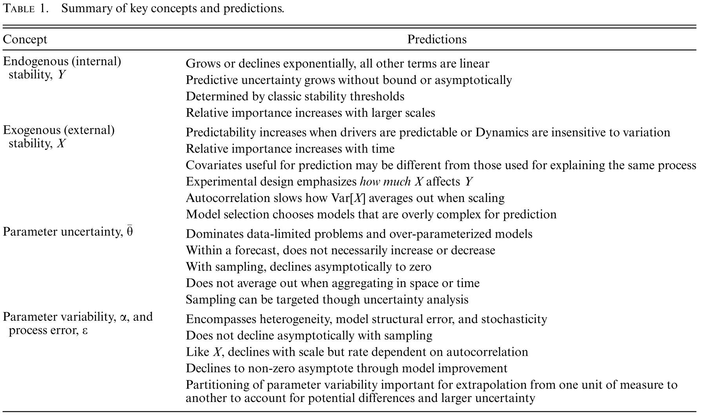

```{r setup, include=FALSE}
knitr::opts_chunk$set(echo = TRUE)
```

The propagation of uncertainty into predictions is one of the key things that set forecasts apart from just running models. The aim of this exercise is to build on work in previous chapters to show how to propagate uncertainty into a forecasts built upon the outputs from a simple but non-trivial state space model. In particular, we are going to start by looking at the data and model but will take it's MCMC output as a given. To explore the uncertainties in the forecast we will start by building a function that allows us to run a forward simulation and then look at what that model predicts when run deterministically (ignoring all uncertainties). Next we will incrementally add different uncertainties in one-at-a-time to see how this changes the forecast.

In exploring uncertainties we will explictly do so within the framework in Dietze 2017 (Ecol Appl.), which is also discussed in Chapter 2.5.3. Specifically, we consider a dynamic model that predicts the future state of the system, $Y_{t+1}$, given the current state, $Y_t$, a set of covariates/drivers, $X_t$, model parameters, $\theta$, random effects, $\alpha$, and process error, $\epsilon$

$$Y_{t+1} = f(Y_t,X_t | \theta + \alpha) + \epsilon$$   {#eq:eqn1}

Given this general model we can partition the forecast uncertainty into the following terms:

$$Var[Y_{t+1}] \approx \underbrace{\left (\frac{\partial f}{\partial Y}\right )^2 Var[Y_t]}_{Initial \; Conditions}
 + \underbrace{\left (\frac{\partial f}{\partial X}\right )^2 Var[X_t]}_{Drivers}
 + \underbrace{\left (\frac{\partial f}{\partial \theta}\right )^2  Var[\theta]  }_{Parmeters}
 + \underbrace{\left (\frac{\partial f}{\partial \theta}\right )^2   Var[\alpha] }_{Random \; Effects}
 + \underbrace{Var[\epsilon]}_{error}$$   {#eq:eqn2}

Qualitatively, this framework allows us to make a number of predictions about the specific terms and their contribution to ecological forecast uncertainty




However, as well see below, one strength of this framework is that it can also be applied quantitatively to understand how different uncertainties affect real predictions. 

## Logistic Growth

```{r, echo=FALSE}
load("data/Ch11_UA.RData")
library(ecoforecastR)
```

To put this framework into practice consider the following data, which consists of population time-series for `r NT` years from `r NS` sites.

```{r,echo=FALSE}
plot(0,0,type = "n",xlim=c(0,NT),ylim = range(No),xlab="time",ylab="No")
for(s in 1:NS) {
  points(No[s,],col=s,type='b')
} 
```

Within this dataset `No[s,t]` is the observed population at a specific site, s, and time, t. Exploratory analyses suggest that different sites have different carrying capacities, K, and that population fluctuations seem to be related to interannual variability in precipitation.

```{r, echo=FALSE}
plot(precip,type='b',xlab="time",ylab="precip (mm/yr)")
```

Based on this the data was fit to a logistic growth state space model that assumes K has a random site effect, $\alpha_s$, and varies as a function of $log(precip)$. Both the process error, $Q = Var[\epsilon]$, and the observation error, R, are assumed to follow lognormal distributions.

```{r}
logisticRE <- "
model{

  ## priors
  r_global ~ dnorm(0,0.1)     ## across-site mean growth rate
  K_global ~ dlnorm(6,0.01)   ## across-site mean carrying capacity
  beta ~ dnorm(0,0.000001)    ## slope of K response to precip
  tau_site ~ dgamma(0.1,0.1)  ## site random effect precision
  R ~ dgamma(0.01,0.00000001) ## Observation error precision
  Q ~ dgamma(0.01,0.00000001) ## Process errror precision 

  ## random effects and initial conditions, s = site
  for(s in 1:NS){
    alpha_site[s] ~ dnorm(0,tau_site)  ## random site effect on K
    lN[s,1] ~ dnorm(6,0.001)           ## prior on IC, log scale
    N[s,1] <- exp(lN[s,1])             ## IC, linear scale
  }

  ## process model, t = time, s = site
  for(t in 2:NT){
    for(s in 1:NS){

      ## K is a linear model with a site random effect and fixed effect on log(precip)
      K[s,t]  <- max(1,K_global+alpha_site[s]+beta*log(precip[t]/800))  

      ## standard logistic growth process model, logged     
      mu[s,t] <- log(max(1,N[s,t-1] + r_global*N[s,t-1]*(1-N[s,t-1]/K[s,t])))

      ## process error
      lN[s,t] ~ dnorm(mu[s,t],Q)
      N[s,t] <- exp(lN[s,t])
    }
  }
  ## observation model
  for(t in 1:NT){
    for(s in 1:NS){
      No[s,t] ~ dlnorm(lN[s,t],R)
    }
  }
}
"
```

The variable names Q and R may seem odd but this is done for consistency with material we will cover in Chapter 13. 

### Posterior Diagnostics

As noted earlier, we're going to take the fitting of this model to the data as a given, and work with the posterior distributions, but if you are unsure about how this is done please go back and look at Exercises 5 and 6 and the Chapter 6 activities. Here are the basic diagnostics showing the posterior estimates of the parameters and states.

```{r, fig.asp=0.8}
## parameters
plot(out$params)
summary(out$params)

## states  
ci <- apply(as.matrix(out$predict),2,quantile,c(0.025,0.5,0.975))
time = 1:NT
plot(0,0,type = "n",xlim=c(0,NT),ylim = range(ci),xlab="time",ylab="N")
for(s in 1:NS){
  sel = seq(s,ncol(ci),by=NS)
  ecoforecastR::ciEnvelope(time,ci[1,sel],ci[3,sel],col=col.alpha(s,0.6))
  lines(time,ci[2,sel],col=s)
  points(time,No[s,],col=s,pch=19)
  points(time,No[s,])
}
```

## Forward Simulation

```{r, echo=FALSE}
### settings
s <- 6             ## Focal site for forward simulation
Nmc = 1000         ## set number of Monte Carlo draws
ylim = c(100,700)  ## set Y range on plot
N.cols <- c("black","red","green","blue","orange") ## set colors
trans <- 0.8       ## set transparancy
time = 1:(NT*2)    ## total time
time1 = 1:NT       ## calibration period
time2 = time1+NT   ## forecast period
```

Before we get started with prediction, let's focus in on a single site to make the task a bit simpler. Because we'll want to display this site for all the different model runs we do let's create a simple function to encapsulate making the plot rather than cluttering our code with constant cut-and-paste redundance.

```{r}
plot.run <- function(){
  sel = seq(s,ncol(ci),by=NS)
  plot(time,time,type='n',ylim=ylim,ylab="N")
  ecoforecastR::ciEnvelope(time1,ci[1,sel],ci[3,sel],col=col.alpha("lightBlue",0.6))
  lines(time1,ci[2,sel],col="blue")
  points(time1,No[s,])
}
```
```{r,echo=FALSE}
ci <- apply(as.matrix(out$predict),2,quantile,c(0.025,0.5,0.975))
plot.run()
```

Our next goal in making a forecast is to run the model forward under it's 'default' values, which we'll take as the mean of the various inputs. To help us out let's make another function that encapsulates our model and generalizes it for the different cases we'll need. This code is directly analogous to the process model in the earlier JAGS code, and we don't need to replicate the data or parameter models.

```{r}
##` @param IC    Initial Conditions
##` @param r     Intrinsic growth rate
##` @param Kg    Across-site ('global') mean carrying capacity
##` @param alpha Site random effect
##` @param beta  Slope of precipitation effect on K
##` @param ppt   Precipitation forecast
##` @param Q     Process error (default = 0 for deterministic runs)
##` @param n     Size of Monte Carlo ensemble
forecastN <- function(IC,r,Kg,alpha,beta,ppt,Q=0,n=Nmc){
  N <- matrix(NA,n,NT)  ## storage
  Nprev <- IC           ## initialize
  for(t in 1:NT){
    K = pmax(1,Kg + alpha + beta*log(ppt[,t]/800))  ## calculate carrying capacity
    mu = log(pmax(1,Nprev + r*Nprev*(1-Nprev/K)))   ## calculate mean
    N[,t] <- rlnorm(n,mu,Q)                         ## predict next step
    Nprev <- N[,t]                                  ## update IC
  }
  return(N)
}
```

### Deterministic prediction

To make a deterministic prediction, we'd then want to calculate the means of all of our different inputs and pass these means to our model. Since there run is deterministic, we only need to run it once (n=1)

```{r}
## calculate mean of all inputs
ppt.mean <- matrix(apply(ppt_ensemble,2,mean),1,NT) ## driver
## parameters
params <- as.matrix(out$params)
param.mean <- apply(params,2,mean)
## initial conditions
IC <- as.matrix(out$predict)

N.det <- forecastN(IC=mean(IC[,"N[6,30]"]),
                   r=param.mean["r_global"],
                   Kg=param.mean["K_global"],
                   alpha=param.mean["alpha_site[6]"],
                   beta=param.mean["beta"],
                   ppt=ppt.mean,
                   Q=0,  ## process error off
                   n=1)

## Plot run
plot.run()
lines(time2,N.det,col="purple",lwd=3)
```

# Monte Carlo Error Propagation

For each source of uncertainty we'll be exploring the Monte Carlo approach to error propagation. As a starting point let's start with the initial condition uncertainty. For this set of runs we'll want to continue to hold all the parameters and drivers at their means, and keep the process error off, but we'll vary the initial conditions. Specifically, we'll run the model `r Nmc` times, and each time we run the model we'll start from a different initial condition. For this analysis the distribution of initial conditions that we want to sample from is just the posterior distribution of the population size at our focal site in the last year of the calibration period, `N[6,30]`. Because we know that posterior distributions often have covariances among parameters, rather than sample the posterior state directly we're going to sample the _row numbers_ in the MCMC output. We'll save these row numbers and use the same rows when we later sample the model parameters, process error, and random effects as well. While we had the benefit of the posterior state estimate here, in other contexts the initial condition uncertainty might be derived directly from field sampled data, or (for unmeasured sites) may require another statistical model to make a _spatial_ prediction of the state of the system to new locations. If we're particularly data limited we may have to rely on Bayesian priors to inform the initial conditions (e.g. through expert elicitation).

### Initial Condition uncertainty
```{r}
## sample parameter rows from previous analysis
prow = sample.int(nrow(params),Nmc,replace=TRUE)

N.I <- forecastN(IC=IC[prow,"N[6,30]"],  ## sample IC
                   r=param.mean["r_global"],
                   Kg=param.mean["K_global"],
                   alpha=param.mean["alpha_site[6]"],
                   beta=param.mean["beta"],
                   ppt=ppt.mean,
                   Q=0,
                   n=Nmc)

## Plot run
plot.run()
N.I.ci = apply(N.I,2,quantile,c(0.025,0.5,0.975))
ecoforecastR::ciEnvelope(time2,N.I.ci[1,],N.I.ci[3,],col=col.alpha(N.cols[1],trans))
lines(time2,N.I.ci[2,],lwd=0.5)
```

**Question 1:** Describe the pattern to the initial condition uncertainty and compare that to your expectations (e.g. Table 1).

### Parameter uncertainty

Next, let's add parameter uncertainty to our forecast. To do this we'll want to sample the **joint** parameter posterior distribution using the row numbers as before. In this forecast we're still running `r Nmc` model runs, but now each run get's its own unique parameters _and_ it's own unique initial conditions. We expect the total uncertainty to increase, so we can layer the run both uncertainties on top of the run with just initial conditions to get a feel for how much more uncertainty is added when we incorporate parameter uncertainty.

One important thing that is important to note about the parameter uncertainty propagation is that it relies on having meaningful estimates of parameter uncertainty. That's not to say that forecasts can't be done with priors (e.g. through literature synthesis or expert elicitation), but forecasting what you expect to happen in a real system is definitely different than slapping an arbitrary uniform prior on default parameters (e.g. +/- 20%).

```{r}
N.IP <- forecastN(IC=IC[prow,"N[6,30]"],  ## sample IC
                   r=params[prow,"r_global"],  ## sample parameters
                   Kg=params[prow,"K_global"],
                   alpha=params[prow,"alpha_site[6]"],
                   beta=params[prow,"beta"],
                   ppt=ppt.mean,
                   Q=0,
                   n=Nmc)

## Plot run
plot.run()
N.IP.ci = apply(N.IP,2,quantile,c(0.025,0.5,0.975))
ecoforecastR::ciEnvelope(time2,N.IP.ci[1,],N.IP.ci[3,],col=col.alpha(N.cols[2],trans))
ecoforecastR::ciEnvelope(time2,N.I.ci[1,],N.I.ci[3,],col=col.alpha(N.cols[1],trans))
lines(time2,N.I.ci[2,],lwd=0.5)
```

**Question 2:** 
A) Describe the pattern and relative magnitude of the parameter uncertainty and compare this to your expectations. 
B) Using the existing model and Monte Carlo approach, describe how you might partition the contribution of each parameter (r, Kg, alpha, beta) to the forecast uncertainty.

### Driver uncertainty

Within our forecast precipitation is the primary extrinsic driver, and thus to make a forecast of our population we need to be able to make a forecast of this driver as well. Here we're going to rely on a `NE` member ensemble of precipitation forecasts, and as you can see the uncertainty in this forecasts grows with time.

```{r,echo=FALSE}
plot(time2,ppt_ensemble[1,],type='n',ylim=range(ppt_ensemble),xlab="time",ylab="precipitation (mm)")
for(i in 1:NE){
  lines(time2,ppt_ensemble[i,],lwd=0.5,col="grey")
}
```

This example of having a smaller number of driver ensembles is not uncommon, and we can handle this easily by resampling _with replacement_ the ensemble members (again, represented as row numbers) the same number of times as our overall ensembles. Thus, while every run may have a unique initial condition and parameter combination, many runs share the same drivers.

When driving ecological forecasts with other forecast outputs (weather, land use, economics, etc), it is important to remember that we can only resample **predictions** or we can sample ensemble members **within a projection**, but we CANNOT resample **across projections**. For example, if I have a given climate scenario (e.g. RCP4.5), I can resample over what different climate models predict, but I cannot resample across the different scenarios, because those scenarios themselved do not represent random draws from the distribution of possible futures.

```{r}
## sample driver rows
drow = sample.int(nrow(ppt_ensemble),Nmc,replace=TRUE)

N.IPD <- forecastN(IC=IC[prow,"N[6,30]"],  ## sample IC
                   r=params[prow,"r_global"],  ## sample parameters
                   Kg=params[prow,"K_global"],
                   alpha=params[prow,"alpha_site[6]"],
                   beta=params[prow,"beta"],
                   ppt=ppt_ensemble[drow,],   ## Sample drivers
                   Q=0,
                   n=Nmc)

## Plot run
plot.run()
N.IPD.ci = apply(N.IPD,2,quantile,c(0.025,0.5,0.975))
ecoforecastR::ciEnvelope(time2,N.IPD.ci[1,],N.IPD.ci[3,],col=col.alpha(N.cols[3],trans))
ecoforecastR::ciEnvelope(time2,N.IP.ci[1,],N.IP.ci[3,],col=col.alpha(N.cols[2],trans))
ecoforecastR::ciEnvelope(time2,N.I.ci[1,],N.I.ci[3,],col=col.alpha(N.cols[1],trans))
lines(time2,N.I.ci[2,],lwd=0.5)
```

**Question 3:** As before, describe the pattern of how driver uncertainty contributes to the forecast and compare that to our first principles expectations.

### Process uncertainty

Adding process error to the model looks similar to both older _stochastic_ modeling approachs and to the _residual_ error in statistical models. However, it is subtly distinct in a few important ways. First, unlike theoretical stochastic models, process error is estimated explictly by fitting models to data. Second, unlike residual error, when we estimate process error we partition it from the observation error. Thus the process error represents things in the process that the model is unable to capture (which will always occur because all models are approximations). The distinction between process and observation error is important because observation error only affects the current observation, but process error propagates into the future.

```{r}
## process error samples
Qmc <- 1/sqrt(params[prow,"Q"])  ## convert from precision to standard deviation

N.IPDE <- forecastN(IC=IC[prow,"N[6,30]"],  ## sample IC
                   r=params[prow,"r_global"],  ## sample parameters
                   Kg=params[prow,"K_global"],
                   alpha=params[prow,"alpha_site[6]"],
                   beta=params[prow,"beta"],
                   ppt=ppt_ensemble[drow,],   ## Sample drivers
                   Q=Qmc,
                   n=Nmc)

## Plot run
plot.run()
N.IPDE.ci = apply(N.IPDE,2,quantile,c(0.025,0.5,0.975))
ecoforecastR::ciEnvelope(time2,N.IPDE.ci[1,],N.IPDE.ci[3,],col=col.alpha(N.cols[4],trans))
ecoforecastR::ciEnvelope(time2,N.IPD.ci[1,],N.IPD.ci[3,],col=col.alpha(N.cols[3],trans))
ecoforecastR::ciEnvelope(time2,N.IP.ci[1,],N.IP.ci[3,],col=col.alpha(N.cols[2],trans))
ecoforecastR::ciEnvelope(time2,N.I.ci[1,],N.I.ci[3,],col=col.alpha(N.cols[1],trans))
lines(time2,N.I.ci[2,],lwd=0.5)
```

**Question 4:** Why might the relative contribution of the process error decline with time? Does this match expectations?

### Random Effect uncertainty

The last figure above represent our best forecast if we're making an **in-sample** prediction (i.e. forecasting one of the sites that we have previously studied). However, if we are making an **out-of-sample** prediction to a new site then there is an additional source of uncertainty that needs to be considered -- the unexplained site-to-site variability being captured by the random effect. When we're making an in-sample prediction we use the posterior $\alpha$ associated with that specific site, but for a new site we need to move up a level in the hierarchical model and sample new alpha values using the across-site precision, $\tau_{site}$. While the out-of-sample forecast is going to have greater uncertainty (which makes intuitive sense and is a desirable feature), there's no guarantee that the in-sample prediction is within the predictive interval of the out-of-sample prediction because the focal site might have been above- or below-average relative to the across-site mean.

```{r}
## Random effect samples
tau.mc <- 1/sqrt(params[prow,"tau_site"]) ## converst from precision to std deviation
aNew.mc <- rnorm(Nmc,0,tau.mc)

N.IPDEA <- forecastN(IC=IC[prow,"N[6,30]"],  ## sample IC
                   r=params[prow,"r_global"],  ## sample parameters
                   Kg=params[prow,"K_global"],
                   alpha=aNew.mc,              ## sample random effect
                   beta=params[prow,"beta"],
                   ppt=ppt_ensemble[drow,],   ## Sample drivers
                   Q=Qmc,
                   n=Nmc)

## Plot run
plot.run()
N.IPDEA.ci = apply(N.IPDEA,2,quantile,c(0.025,0.5,0.975))
ecoforecastR::ciEnvelope(time2,N.IPDEA.ci[1,],N.IPDEA.ci[3,],col=col.alpha(N.cols[5],trans))
ecoforecastR::ciEnvelope(time2,N.IPDE.ci[1,],N.IPDE.ci[3,],col=col.alpha(N.cols[4],trans))
ecoforecastR::ciEnvelope(time2,N.IPD.ci[1,],N.IPD.ci[3,],col=col.alpha(N.cols[3],trans))
ecoforecastR::ciEnvelope(time2,N.IP.ci[1,],N.IP.ci[3,],col=col.alpha(N.cols[2],trans))
ecoforecastR::ciEnvelope(time2,N.I.ci[1,],N.I.ci[3,],col=col.alpha(N.cols[1],trans))
lines(time2,N.I.ci[2,],lwd=0.5)
```

# Uncertainty Analysis

Our final analysis is focused on quantifying the relative contributions of each of the 5 uncertainty terms to the overall predictive variance, and how that partitioning changes with time. To do this we will calculate the variances, because unlike predictive intervals or standard errors variances combine additively.

```{r}
### calculation of variances
varI     <- apply(N.I,2,var)
varIP    <- apply(N.IP,2,var)
varIPD   <- apply(N.IPD,2,var)
varIPDE  <- apply(N.IPDE,2,var)
varIPDEA <- apply(N.IPDEA,2,var)
varMat   <- rbind(varI,varIP,varIPD,varIPDE,varIPDEA)

## out-of-sample stacked area plot
V.pred.rel <- apply(varMat,2,function(x) {x/max(x)})
plot(time2,V.pred.rel[1,],ylim=c(0,1),type='n',main="Relative Variance: Out-of-Sample",ylab="Proportion of Variance",xlab="time")
ciEnvelope(time2,rep(0,ncol(V.pred.rel)),V.pred.rel[1,],col=N.cols[1])
ciEnvelope(time2,V.pred.rel[1,],V.pred.rel[2,],col=N.cols[2])
ciEnvelope(time2,V.pred.rel[2,],V.pred.rel[3,],col=N.cols[3])
ciEnvelope(time2,V.pred.rel[3,],V.pred.rel[4,],col=N.cols[4])
ciEnvelope(time2,V.pred.rel[4,],V.pred.rel[5,],col=N.cols[5])
legend("topleft",legend=c("RandomEffect","Process","Driver","Parameter","InitCond"),col=rev(N.cols),lty=1,lwd=5)

## in-sample stacked area plot
V.pred.rel.in <- apply(varMat[-5,],2,function(x) {x/max(x)})
plot(time2,V.pred.rel.in[1,],ylim=c(0,1),type='n',main="Relative Variance: In-Sample",ylab="Proportion of Variance",xlab="time")
ciEnvelope(time2,rep(0,ncol(V.pred.rel.in)),V.pred.rel.in[1,],col=N.cols[1])
ciEnvelope(time2,V.pred.rel.in[1,],V.pred.rel.in[2,],col=N.cols[2])
ciEnvelope(time2,V.pred.rel.in[2,],V.pred.rel.in[3,],col=N.cols[3])
ciEnvelope(time2,V.pred.rel.in[3,],V.pred.rel.in[4,],col=N.cols[4])
legend("topleft",legend=c("Process","Driver","Parameter","InitCond"),col=rev(N.cols[-5]),lty=1,lwd=5)
```


**Question 5:**  Based on results, where would you focus your research efforts next if your aim was to improve out-of-sample predictions? What about in-sample predictions?

## Next steps:

The Monte Carlo approach to uncertainty propagation is very flexible and general, however for computationally demanding models it can also be limiting because of the large ensemble sizes required to approximate the full predictive distribution. As discussed in Chapter 11, there are alternative approaches that can be applied in these cases, but at the cost of additional assumptions and/or analytical complexity. We'd encourage you to explore how these other methods could be implemented for the above analysis:

**1) Ensemble uncertainty propagation:** 
The ensemble approach is very similar to the Monte Carlo approach but replaces the Monte Carlo approximation of the full predictive distribution with the approximation that the ensemble corresponds to a known probability distribution (e.g. Gaussian). Because it usually takes a much smaller sample size to get a stable estimate of a distribution's parameters (e.g. Gaussian mean and standard deviation), the size of the ensemble can be smaller provided the distributional assumption gives a good approximation. To implement the above analysis as an ensemble:

* Change the lines that calculate predictive intervals using quantiles (e.g. `apply(N.*,2,quantile,c(0.025,0.5,0.975)))`) to instead calculate the mean and standard deviation
* Then calculate the predictive interval using these statistics.
* Compare the Gaussian approximation to the full Monte Carlo ensemble
* Reduce the sample size, `Nmc`, by 10-50x and assess how the Gaussian approximation compares to the original and updated Monte Carlo estimates.

**2) Analytical uncertainty propagation:**
For even more computationally demanding problems, or problems where an analytical solution is desirable, it is also possibly to approximate the uncertainty propagation analytically:

* As a first-order approximation, assume that the single deterministic model run approximates the mean. It is important to realize that this violates Jensen's Inequality (mean of the function does not equal the function of the mean) but improving this approximation requires solving for the second deriatives (book eqn 11.2)
* Approximate the forecast variance through time by applying Eqn 2 above to the logistic growth model. This will require taking the partial derivatives of the model with respect to each of the terms in the equation
    + state = Y = N
    + drivers = X = precip
    + parameters = $\theta$ = $[r, Kg, \beta]$
    + random effects = $\alpha$
* Next you need to analytically calculate the variance of the initial conditions, drivers, parameters, random effects, and process error = $Var[\epsilon]$ = Q
* Finally, because the forecast variance has to be solved iteratively (same as the mean), you need to create an alternative version of the `forecastN` function that calculates both N and VarN for each time step
* Partitioning variances just requires keep track of each of the terms ($derivative^2 Var$)
* Once you get the basic version working, you'll want to improve the approximation by including the covariance terms among parameters (book eqn 11.5)

**3) Interactions between uncertainties:**
The approach used above is based on sequentially adding different sources of uncertainty to the full model. This raises two questions: (1) How sensitive are the results to the order the variables are introduced and (2) to what extent do variables interact with each other.  Use the analytical rules for combining variances (Chapter 11 appendices) to address these questions, and estimate the interaction terms between the uncertainties, for the "in sample" site-level run. Do this either numerically (Monte Carlo or Ensemble approach) or Analytically. If approaching numerically, I'd give the hint that Var(A+B) = Var(A) + Var(B) + Cov(A,B). For example, if A = IC and B = parameters, then Var(A) comes from runs with just IC, Var(B) comes from runs with just parameter error, Var(A+B) comes from runs with both, and the covariance Cov(A,B), which provides a measure of the interaction between A and B, is found by difference. Also recall from chapter 2 (Box 2.1) that covariances can be decomposed into correlations, which are often easier to interpret.