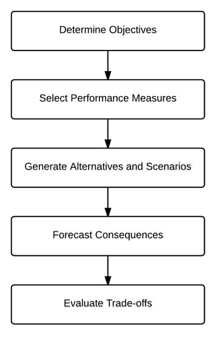

Individual Exercise: Booking travel
-------------------------------------

As a simple example of understanding how to construct and analyze a consequence table, consider the task of booking a travel for a conference (e.g. flight). Frame this around a specific trip (real or hypothetical), with specific dates of travel, and the real constraints you have on your travel (work, obligations to friends and family, budget, ethics, etc.). In the course of this exercise you will go through the steps of structured decision making by: considering what values/objectives affect how your choice of travel; decide how you'll quantify those measures; research different travel alternatives online; populate the consequences; analyze/refine your table to identify key trade-offs. In this example, you are your own decision maker, so also include your final decision about what travel you would book, explaining the values you placed on the different objectives. 

Individuals should turn in a _single_ written document that includes:

1. Your 'raw' consequence table
2. A quick "executive summary" of the final (analyzed) consequence table and trade-offs
3. Brief summaries of your thinking/choices and what you did at each step.
4. Your final decision

The consequence table is generated through the following steps:

1. **Determine Objectives:** Objectives consist of a few words that summarize something that matters to the stakeholders, in the specific context of the decision being discussed, and the desired direction of change (e.g. minimize cost). In a group decision, different stakeholders need not agree on how much they value a specific objective, but inclusion does validate that a specific objective has value. For this exercise you consider at least 4 objectives.
2. **Select Performance Measures:** Performance measures should quantify objectives in units that are appropriate for that objective and should not be monetized unless it is normal to think about the objective in monetary terms. Performance measures _define_ the metrics being used, they don't _calculate_ them.
3. **Generate Alternatives and Scenarios:** Construct 4 - 12 alternatives that creative explore the space of possible choices. Alternatives need to be complete, comparable, and internally consistent solutions. This means that all alternatives address the same problem, evaluated over the same time, to the same level of detail, and with the same assumptions and performance metrics. 
4. **Forecast Consequences:** Forecasting consequences robustly has been the focus of this entire course, so generating precise, data-driven forecasts is beyond the scope of this activity. Here you will rely mostly online resources (e.g. airfare search sites, sites rating quality/reliability/etc, carbon footprint calculators) to populate your table. In other contexts you may reply on elicitation (Box 5.5.1) and back-of-the-envelope [Fermi estimation](https://en.wikipedia.org/wiki/Fermi_problem) to generate first-pass estimates. Such estimates are valuable, even in real decision making, for sorting out where more detailed, quantitative forecasting is nessisary.
5. **Evaluate Trade-offs:** Iteratively improve the set of alternatives by (1) deleting bad alternatives and insensitive performance measures and (2) refining your understanding of the key trade-offs. The goal isn't to provide a single recommendation, but to elimnate dominated alternatives and clarify the fundamental trade-offs that policy makers face.

