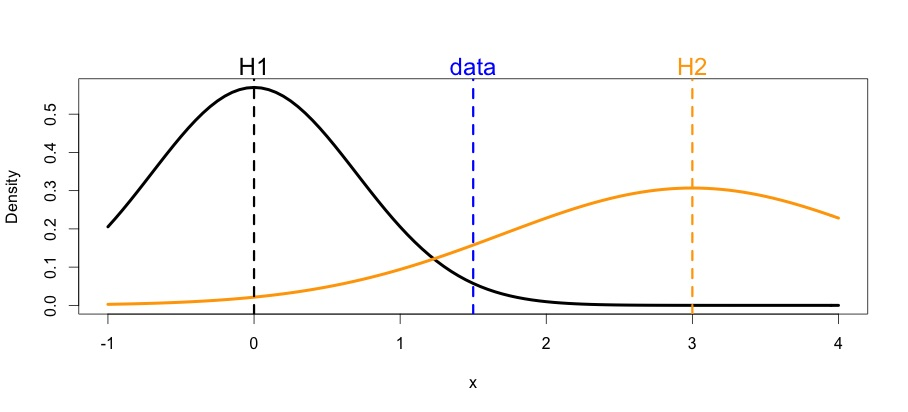

```{r,echo=FALSE}
library(mvtnorm)
```


This activity was developed as a Rmd Notebook. When you save the notebook, an HTML file containing the code and output will be saved alongside it (click the *Preview* button or press *Cmd+Shift+K* to preview the HTML file). The preview shows you a rendered HTML copy of the contents of the editor. Consequently, unlike *Knit*, *Preview* does not run any R code chunks. Instead, the output of the chunk when it was last run in the editor is displayed.

## Learning objectives

The goal of this primer is to gain a basic introduction to:

* Sources of uncertainty
* Monte Carlo uncertainty propagation
* Uncertainty partitioning
* Likelihood
* Forecast-Analysis Cycle
* Iterative Data Assimilation

## A Simple Disease Model

Consider the problem of predicting the progression of an infectious disease through a susceptible population. There are many approaches that could be taken to modeling disease dynamics, most all of which are compatible with the forecasting approached discussed here. For simplicity, we'll start with a simple discrete-time stochastic version of the classic Susceptible-Infected-Recovered (SIR) model.

In this model the expected number of Susceptible individuals at the next point in time $S_{t+1}$, is the number right now, $S_t$,  minus the number of 
new cases $C_t$

$$S_{t+1} = S_{t} - C_t$$

The expected number of new cases depends on the number of susceptibles and the infection probability $k$, which itself depends on the number of Infected individuals

$$k_t = \beta I_t$$

To account for the stochasticity in encounters, let's model new infections as a Binomial (i.e. coin flipping) process

$$C_t \sim Binom(n = S_t,p = \beta I_t) $$ 

Next, let's similarly assume that Infected individual become healthy at a constant recovery rate $r$, which we can likewise model as a Binomial process

$$H_t \sim Binom(I_t,r)$$

Following the assumptions of the SIR model, this pool of newly healthy individuals dones not return to being susceptible, but enters a pool of Recovered individuals that are immune to this particular disease. The remaining dynamics of the model thus becomes

$$ R_{t+1} = R_{t} + H_t$$

$$ I_{t+1} = I_t + C_t - H_t$$

## Sources of Uncertainty

Before we can make a forecast with our SIR model we need to consider the uncertainties that affect our prediction. In exploring uncertainties we will use the framework in Dietze 2017a. Specifically, we will consider a dynamic model that predicts the future state of the system, $Y_{t+1}$, given the current state, $Y_t$, a set of covariates/drivers, $X_t$, model parameters, $\theta$, random effects, $\alpha$, and process error, $\epsilon$

$$Y_{t+1} = f(Y_t,X_t | \theta + \alpha) + \epsilon$$   {#eq:eqn1}

Given this general model we can partition the forecast uncertainty into the following terms:

$$Var[Y_{t+1}] \approx \underbrace{\left (\frac{\partial f}{\partial Y}\right )^2 Var[Y_t]}_{Initial \; Conditions}
 + \underbrace{\left (\frac{\partial f}{\partial X}\right )^2 Var[X_t]}_{Drivers}
 + \underbrace{\left (\frac{\partial f}{\partial \theta}\right )^2  Var[\theta]  }_{Parmeters}
 + \underbrace{\left (\frac{\partial f}{\partial \theta}\right )^2   Var[\alpha] }_{Random \; Effects}
 + \underbrace{Var[\epsilon]}_{error}$$   {#eq:eqn2}

Qualitatively, this framework allows us to make a number of predictions about the specific terms and their contribution to ecological forecast uncertainty


For our SIR model, Y is the vector of our three states, $Y_t = {S_t,I_t,R_t}$, so we need to consider the uncertainty in the initial state of the system. In our current model, neither infection $\beta$ nor recovery $r$ depend on external environmental conditions, so we can initially ignore this term. That said, we do need to consider the parameter uncertainty about $\beta$ and $r$. In terms of process error $\epsilon$, our model already includes the demographic stochasticity in our two Binomial processes, but it doesn't consider the possibility that the model itself is misspecified or that $\beta$ and $r$ are not the same at all times and all places. We can accommodate this by including parameter variability $\alpha$ in $\beta$ and $r$. An important point to note here is that the _uncertainty_ about the 'true' mean of the parameters and the _variability_ in those parameters are fundamentally different -- the parameter uncertainty will decline asymptotically as more information is gathered, but the parameter variability will not unless one can uncover the (up to this point) sources of unexplained variability. That said, no model is perfect, so it's important to acknowledge there will *always* be some unexplained variability.

# Monte Carlo Uncertainty Propagation

Now that we understand our sources of uncertainty we need a way of propagating them into our forecast. There are a number of options for how to do this (Dietze 2017b), but one of the simplest and most robust is Monte Carlo simulation. *Monte Carlo simulation is based on the idea that we can approximate a probability distribution with samples from that distribution*. For example, if we have evidence that suggests the mean recovery rate is $1/7 \text{ days}^{-1}$ (i.e. an average recovery time of 7 days) but with standard error of 10% uncertainty around that, we might approximate this with a log-normal distribution

```{r}
Nmc = 10000 # number of Monte Carlo simulations
r0 = 1/7
r = rlnorm(n = Nmc,meanlog = log(r0),sdlog = exp(r0)*0.1)
hist(r,probability = TRUE,breaks=50)
abline(v=r0,col="red")
rseq=seq(0,0.25,length=1000)
lines(rseq,dlnorm(rseq,meanlog = log(r0),sdlog = exp(r0)*0.1),col="red")
```

Furthermore, we can approximate any statistics about the distribution (mean, median, SD, CI, etc) with the equivalent sample statistic
```{r}
summary(r)
sd(r)
```

To be able to propagate other source of uncertainty we'll want to be able to sample from those distributions as well. Let's assume the following:

* $\beta$ has a mean of 5 in 100,000 with 10% uncertainty
```{r}
beta0 = 5/100000
beta = rlnorm(n = Nmc,meanlog = log(beta0),sdlog = exp(beta0)*0.1)
hist(beta,probability = TRUE)
```

* The initial number of infected individuals $I$ is > 0 and has a mean of 5 
```{r}
I = 1 + rpois(n = Nmc,4)
hist(I,probability = TRUE)
```

* We are confident there are 10,000 people in the population and that no one is immune initially
```{r}
S = 10000-I
R = rep(0,Nmc)
IC = cbind(S,I,R)
```


### Process Error

To illustrate how we apply Monte Carlo simulation to the problem of forward prediction, let's start with the simplest case, the propagation of the demographic stochasticity (process error). In traditional stochastic simulation this often would have been the only source of uncertainty/variability considered. To facilitate this analysis let's construct a function that forward simulates our model:

```{r}
forecastSIR <- function(IC,r,beta,NT){
  if(length(r) == 1)    r = rep(r,NT)       ## if r and beta are not time varying, make them all the same
  if(length(beta) == 1) beta = rep(beta,NT)
  SIR <- matrix(NA,NT,3)  ## storage
  SIR[1,] <- IC           ## initialize
  for(t in 1:(NT-1)){
    C = rbinom(1,size = SIR[t,1],prob = min(1,beta[t]*SIR[t,2])) ## new cases
    H = rbinom(1,size = SIR[t,2],prob = r[t])                    ## recovery
    SIR[t+1,1] <- SIR[t,1] - C                                   ## susceptible
    SIR[t+1,2] <- SIR[t,2] + C - H                               ## infected
    SIR[t+1,3] <- SIR[t,3] + H                                   ## recovered
  }
  return(SIR)
}
```

Next, let's make a prediction forward using the means of each of our parameters

```{r}
rbar  = mean(r)
bbar  = mean(beta)
ICbar = round(apply(IC,2,mean))
NT = 100

SIR0 = forecastSIR(ICbar,rbar,bbar,NT)

plot(SIR0[,1],type='l',log='y',ylim=c(1,sum(ICbar)),
     xlab="days",ylab="Population (log scale)",lwd=3)
lines(SIR0[,2],col="red",lwd=3)
lines(SIR0[,3],col="blue",lwd=3)
legend("topright",legend = c("S","I","R"),lwd=3,col=c("black","red","blue"))

```

This represents just a single realization of a possible future. To characterize the uncertainty, and generate probability distributions for predictions, we'd want to generate whole ensembles of runs

```{r}
SIR_E = array(data = NA,dim = c(Nmc,NT,3))

for(i in 1:Nmc){
  SIR_E[i,,] = forecastSIR(ICbar,rbar,bbar,NT)
}
```

Sample of predictions
```{r}
plot(SIR_E[1,,1],type='l',log='y',ylim=c(1,sum(ICbar)),
     xlab="days",ylab="Population (log scale)")
for(i in 1:25){
  lines(SIR_E[i,,1])
  lines(SIR_E[i,,2],col="red")
  lines(SIR_E[i,,3],col="blue")
}
legend("topright",legend = c("S","I","R"),lwd=3,col=c("black","red","blue"))
```

Whole ensemble
```{r}
SIR_Eci = apply(SIR_E,3,function(x){apply(x,2,quantile,c(0.025,0.5,0.975))})  ## calculate CI
SIR_Eci[SIR_Eci==0] <- 0.1 ## sub just for log-scale plotting

## helpers
time = 1:NT
ind = seq(1,by=3,length=NT) # index
ciEnvelope <- function (x, ylo, yhi, ...) {
    polygon(cbind(c(x, rev(x), x[1]), c(ylo, rev(yhi), ylo[1])), border = NA, ...)
}
col.alpha <- function (col, alpha = 1) {
    rgb = col2rgb(col)
    rgb(rgb[1], rgb[2], rgb[3], alpha * 255, maxColorValue = 255)
}

plot(time,SIR_Eci[ind+1,1],type='l',log='y',ylim=c(1,sum(ICbar)),
     xlab="days",ylab="Population (log scale)",lwd=3)
ciEnvelope(time,SIR_Eci[ind,1],SIR_Eci[ind+2,1],col=col.alpha("grey",0.5))
lines(SIR_Eci[ind+1,2],col="red",lwd=3)
ciEnvelope(time,SIR_Eci[ind,2],SIR_Eci[ind+2,2],col=col.alpha("red",0.5))
lines(SIR_Eci[ind+1,3],col="blue",lwd=3)
ciEnvelope(time,SIR_Eci[ind,3],SIR_Eci[ind+2,3],col=col.alpha("blue",0.5))
legend("topright",legend = c("S","I","R"),lwd=3,col=c("black","red","blue"))

```

### Initial Conditions

Next, let's consider the impact of the uncertainty about the initial conditions, which here is a reflection of the uncertainty about the number of infected individuals. This simulation is exactly like before, but instead of feeding every model run the same initial conditions, each run will be assigned it's own unique starting values

```{r}
SIR_EI = array(data = NA,dim = c(Nmc,NT,3))
for(i in 1:Nmc){
  SIR_EI[i,,] = forecastSIR(IC[i,],rbar,bbar,NT)  ## note that IC is now indexed by run [i]
}
```

To keep our visualizations simpler, from here forward let's focus just on the Infected plot
```{r}
SIR_EIci = apply(SIR_EI,3,function(x){apply(x,2,quantile,c(0.025,0.5,0.975))})  ## calculate CI
SIR_EIci[SIR_EIci==0] <- 0.1 ## sub just for log-scale plotting
COLS = c("grey","red","blue","green")

plot(time,SIR_Eci[ind+1,2],type='l',log='y',ylim=c(1,sum(ICbar)),
     xlab="days",ylab="Population (log scale)",lwd=3)
ciEnvelope(time,SIR_EIci[ind,2],SIR_EIci[ind+2,2],col=col.alpha(COLS[2],0.5))
ciEnvelope(time,SIR_Eci[ind,2],SIR_Eci[ind+2,2],col=col.alpha(COLS[1],0.9))
legend("topright",legend = c("Proc","Proc+IC"),lwd=3,col=COLS)
```

### Parameter Uncertainty

Next, let's consider the impact of the uncertainty about the parameter means in $r$ and $\beta$. Here's we'll add this uncertainty on top of the existing process error and initial condition uncertainty.

```{r}
SIR_EIP = array(data = NA,dim = c(Nmc,NT,3))
for(i in 1:Nmc){
  SIR_EIP[i,,] = forecastSIR(IC[i,],r[i],beta[i],NT)  ## note that r and beta are now indexed by run [i]
}
```

```{r}
SIR_EIPci = apply(SIR_EIP,3,function(x){apply(x,2,quantile,c(0.025,0.5,0.975))})  ## calculate CI
SIR_EIPci[SIR_EIPci==0] <- 0.1 ## sub just for log-scale plotting

plot(time,SIR_Eci[ind+1,2],type='l',log='y',ylim=c(1,sum(ICbar)),
     xlab="days",ylab="Population (log scale)",lwd=3)
ciEnvelope(time,SIR_EIPci[ind,2],SIR_EIPci[ind+2,2],col=col.alpha(COLS[3],0.5))
ciEnvelope(time,SIR_EIci[ind,2],SIR_EIci[ind+2,2],col=col.alpha(COLS[2],0.5))
ciEnvelope(time,SIR_Eci[ind,2],SIR_Eci[ind+2,2],col=col.alpha(COLS[1],0.9))
lines(time,SIR_Eci[ind+1,2],lwd=3)
legend("topright",legend = c("Proc","Proc+IC","Proc+IC+Param"),lwd=3,col=COLS)
```

### Parameter Variability

In addition to parameter uncertainty, there's also the need to account for model inadequacy, which in this case we're addressing in terms of unexplained parameter variability in space and time, what statisticians often call random effects. Specifically, let's consider the case where parameters 'evolve' through time in an auto-correlated way, but that the rate of parameter "mutation" is only 1%/day. We can represent that mutation process as a random walk.

```{r}
mutate_b = mutate_r = matrix(1,Nmc,NT)
for(t in 1:(NT-1)){
  mutate_b[,t+1] = mutate_b[,t]*rlnorm(Nmc,meanlog = 0,sdlog = 0.01)
  mutate_r[,t+1] = mutate_r[,t]*rlnorm(Nmc,meanlog = 0,sdlog = 0.01)
}
plot(mutate_b[1,],type='l',ylim = range(mutate_b))
for(i in 1:50){
  lines(mutate_b[i,])
}
```

```{r}
SIR_EIPA = array(data = NA,dim = c(Nmc,NT,3))
for(i in 1:Nmc){
  SIR_EIPA[i,,] = forecastSIR(IC[i,],r[i]*mutate_r[i,],beta[i]*mutate_b[i,],NT)  ## note the existing beta and r being mutated
}
```

```{r}
SIR_EIPAci = apply(SIR_EIPA,3,function(x){apply(x,2,quantile,c(0.025,0.5,0.975))})  ## calculate CI
SIR_EIPAci[SIR_EIPAci==0] <- 0.1 ## sub just for log-scale plotting

plot(time,SIR_Eci[ind+1,2],type='l',log='y',ylim=c(1,sum(ICbar)),
     xlab="days",ylab="Population (log scale)",lwd=3)
ciEnvelope(time,SIR_EIPAci[ind,2],SIR_EIPAci[ind+2,2],col=col.alpha(COLS[4],0.5))
ciEnvelope(time,SIR_EIPci[ind,2],SIR_EIPci[ind+2,2],col=col.alpha(COLS[3],0.5))
ciEnvelope(time,SIR_EIci[ind,2],SIR_EIci[ind+2,2],col=col.alpha(COLS[2],0.5))
ciEnvelope(time,SIR_Eci[ind,2],SIR_Eci[ind+2,2],col=col.alpha(COLS[1],0.9))
lines(time,SIR_Eci[ind+1,2],lwd=3)
legend("topright",legend = c("Proc","Proc+IC","Proc+IC+Param","Full"),lwd=3,col=COLS)
```

### Uncertainty Partitioning

For any forecast, we can also partition out the relative contributions of different uncertainties and how they change over the time horizon

```{r}
### calculation of variances
varE    <- apply(SIR_E[,,2],2,var)
varEI   <- apply(SIR_EI[,,2],2,var)
varEIP  <- apply(SIR_EIP[,,2],2,var)
varEIPA <- apply(SIR_EIPA[,,2],2,var)
varMat   <- rbind(varE,varEI,varEIP,varEIPA)

V.rel <- apply(varMat,2,function(x) {x/max(x)})
plot(time,V.rel[1,],ylim=c(0,1),type='n',main="Relative Variance",ylab="Proportion of Variance",xlab="time")
ciEnvelope(time,rep(0,ncol(V.rel)),V.rel[1,],col=COLS[1])
ciEnvelope(time,V.rel[1,],V.rel[2,],col=COLS[2])
ciEnvelope(time,V.rel[2,],V.rel[3,],col=COLS[3])
ciEnvelope(time,V.rel[3,],V.rel[4,],col=COLS[4])
legend("bottom",legend=c("Parm Var","Parm Unc","InitCond","Process"),col=rev(COLS),lty=1,lwd=5)
```

# Likelihood

Data is the essential fuel for all forecasting. However, to be able to make use of data to constrain forecasts and improve our understanding of systems we need a way of bringing models and data together probabalistically. In both frequentist and Bayesian statistics, the Likelihood is the essential tool for linking models and data.




A likelihood function is used to quantify the probability of observing a specific set of observations (data) given a model and a specific set of model parameters, $Pr(data | model)$. A Likelihood consists of two parts, a _process model_ and a _data model_. What we've focused on up-to-now has been the process model. To be able to link the process model to data we need to use probability to describe the data generating process. For example, imagine that in this case the data are counts of infected individuals at specific points in time. These counts have to be positive (we can't count negative individuals) and discrete (we can't count partial individuals), which narrows us down to a few candidate statistical models (e.g. Poisson, Binomial, Negative Binomial). To know which makes sense we need to understand how the data is collected -- is it a sample or a survey? Are there false positives (individuals diagnosed as positive but not having the disease)? Are there false negatives (e.g. individuals who are ill but not reported, either because of test inaccuracy or a failure to go to a clinic)? In other settings, common data models include things like assumptions of Normally-distributed residual error or Bernoulli error in a logistic regression. 

For this example, let's assume false negatives are dominant, but also that we have prior information that suggests that there's only a 75% chance that an infected individual is diagnosed. We can write this Likelihood as

$$Pr(data | model ) = Binom(Z_t | I_t, \theta)$$

where $Z_t$ is the observed data at time $t$ and $\theta = 0.75$.

As a simulation experiment, let's assume that one of the simulated time-series represents the "truth" and use it to simulate pseudodata. We'll also thin the data to acknowledge that we're unlikely to get a new observation every day.
```{r}
theta = 0.75
I_true = SIR_EIPA[42,,2]
Z = rbinom(length(I_true),size = I_true,theta)
sel = seq(6,NT,by=7)
Z[time[-sel]] <- NA
plot(time,I_true,type='l',log="y",ylab="Infected")
points(time,Z,col="red",pch="+")
legend("topright",legend=c("True","Observed"),pch=c("-","+"),col=1:2)
```

Armed with this observed 'data' we might then ask which of the model projections (which include all uncertainties) are more or less likely to have generated the first data point. For reasons of numerical accuracy, likelihoods are usually calculated on a log scale. Following a Bayesian perspective, the posterior probability of each run is approximated by dividing by the total probability (probability distributions have to sum or integrate to 1). The Bayesian prior is implicit in this approach because ensemble members were originally sampled from their priors.

```{r}
logL = rep(NA,Nmc)
for(i in 1:Nmc){
  logL[i] = sum(dbinom(Z[sel[1]],SIR_EIPA[i,sel[1],2],theta,log=TRUE))
}
posterior = exp(logL)/sum(exp(logL))  ## weight each run
```

So that we don't have to carry these weights around, we then resample in proportion to the posterior probability, in essence implementing a simple Sequential Monte Carlo resampling approach. Having done this, we can then compare these posterior distributions to their original (prior) distributions to see how much they have been updated by the observations

```{r}
p.index = sample.int(Nmc,Nmc,replace=TRUE,prob=posterior) 

I_post = SIR_EIPA[p.index,sel[1],2]
hist(I_post,main="Infected",probability = TRUE,xlim=c(0,100))
lines(density(SIR_EIPA[,sel[1],2]),col="red")
abline(v=Z[sel[1]],lty=2,col=3)
legend("topright",legend=c("prior","posterior","data"),col=c(2:1,3),lwd=2)

beta_post = beta[p.index]
plot(density(beta_post),main="Beta")
lines(density(beta),col="red")
legend("topright",legend=c("prior","posterior"),col=2:1,lwd=2)

r_post = r[p.index]
plot(density(r_post),main="r")
lines(density(r),col="red")
legend("topright",legend=c("prior","posterior"),col=2:1,lwd=2)

S_post = SIR_EIPA[p.index,sel[1],1]
hist(S_post,main="Susceptible",probability = TRUE,xlim=range(SIR_EIPA[,sel[1],1]))
lines(density(SIR_EIPA[,sel[1],1]),col="red")
legend("topright",legend=c("prior","posterior"),col=2:1,lwd=2)

R_post = SIR_EIPA[p.index,sel[1],3]
hist(R_post,main="Recovered",probability = TRUE,xlim=range(SIR_EIPA[,sel[1],3]))
lines(density(SIR_EIPA[,sel[1],3]),col="red")
legend("topright",legend=c("prior","posterior"),col=2:1,lwd=2)
```

In practice, if we wanted to generate more robust estimates of the model's parameters we would want to employ a more involved calibration approach, using either frequentist (Maximum Likelihood) or Bayesian (e.g. MCMC) numerical methods. While we don't have time to get into these methods in this primer, under the hood all these methods are based on the idea of the Likelihood.

# Iterative Data Assimilation and the Forecast-Analysis Cycle

While calibration activities are mostly done using already collected data, in most forecasting activities we are interested in processes as they unfold, with new data being collected as time passes. A key idea in these cases is that forecasts should be updated based on new observations. In this section we combine the two principles above (Monte Carlo simulationa nd Likelihood) to construct a **Forecast-Analysis Cycle** (FAC). A FAC iterates between the two steps of making a forecast (e.g. using Monte Carlo) and performing a statistical analysis to update model states and parameters in light of newly observations. This cycle is the basis of many real-world forecasting activities (e.g. numerical weather prediction).

Thus far, we've seen the first steps of this -- making a forecast and then calculating the likelihood of that new observation. To put this into a cycle we then need to use these updated probability distributions to make a new forecast

An important part of the Forecast-Analysis cycle is that in every iteration we are learning about the JOINT distribution of the model state variables (S, I, R) and model parameters. Because what we're observing is a specific state (I), the strength of the learning about the other states and parameters is proportional to the strength of the correlations between the observed and unobserved quantitites

```{r}
X = cbind(S_post,I_post,R_post,r_post,beta_post)
pairs(X)  ## pairwise scatterplot of joint posterior distribution
Xbar = apply(X,2,mean)
SIGMA = cov(t(t(X)/Xbar))
cor(X)
```

Because our ensemble contains an discrete set of parameter values, and demographic stochasticity does not create new parameter values as the forecast progresses, we also apply a slight smoothing to our posterior.
```{r}
## Kernel smoothing (to avoid ensemble members with identical parameters)
h = 0.9
e = mvtnorm::rmvnorm(n = Nmc,mean = rep(0,5),sigma = SIGMA)
Xstar = t(Xbar + h*(t(X)-Xbar) + t(e)*Xbar*(1-h))
for(i in 1:3) Xstar[,i] = round(Xstar[,i]) ## S,I,R are discrete
for(i in 1:5){
  plot(density(X[,i]),xlim=range(Xstar[,i]))
  lines(density(Xstar[,i]),col=2)
}
```

### Forecast-Analysis Loop

Putting this all together, we end up with a simple cycle of making a forecast, performing the analysis (Likelihood calculation), updating parameters and states by resampling, and then smoothing these estimates.

```{r}
forecast <- forecastCI <- list()
forecast[[1]] <- SIR_EIPA
forecastCI[[1]] <- SIR_EIPAci

for(t in 2:10){
  
  ## Forecast
  forecast[[t]] <- array(data = NA,dim = c(Nmc,NT,3))
  for(i in 1:Nmc){
    forecast[[t]][i,,] = forecastSIR(Xstar[i,1:3],
                                   Xstar[i,4]*mutate_r[i,],
                                   Xstar[i,5]*mutate_b[i,],NT=NT)
  }
  forecastCI[[t]] = apply(forecast[[t]],3,function(x){apply(x,2,quantile,c(0.025,0.5,0.975))})  ## calculate CI
  forecastCI[[t]][forecastCI[[t]]==0] <- 0.1
  
  ## plot
  plot(time,forecastCI[[1]][ind+1,2],type='n',log='y',ylim=c(1,sum(ICbar)),
     xlab="days",ylab="Population (log scale)",lwd=3)
  ciEnvelope(time,forecastCI[[1]][ind,2],forecastCI[[1]][ind+2,2],
             col=col.alpha(COLS[1],0.5))
  for(i in 2:t){
    ciEnvelope(time+sel[i-1]-1,forecastCI[[i]][ind,2],
               forecastCI[[i]][ind+2,2],col=col.alpha(i,0.5))
  }
  points(sel,Z[sel],pch="+",col=c(rep(1,t-1),rep(2,length(sel)-t)))
  lines(I_true)
  
  ## Analysis
  logL = rep(NA,Nmc)
  for(i in 1:Nmc){
    logL[i] = sum(dbinom(Z[sel[t]],forecast[[t]][i,sel[t]-sel[t-1],2],theta,log=TRUE))
  }
  posterior = exp(logL)/sum(exp(logL))
  
  ## resample to update
  p.index = sample.int(Nmc,Nmc,replace=TRUE,prob=posterior)
  X = cbind(forecast[[t]][p.index,sel[1],],Xstar[,4:5])[p.index,]
  Xbar = apply(X,2,mean)
  SIGMA = cov(t(t(X)/Xbar))
  
  ## smooth
  e = mvtnorm::rmvnorm(n = Nmc,mean = rep(0,5),sigma = SIGMA)
  Xstar = t(Xbar + h*(t(X)-Xbar) + t(e)*Xbar*(1-h))
  for(i in 1:3) Xstar[,i] = round(Xstar[,i]) ## S,I,R are discrete
  
}

```

This series of figures shows each iteration of the forecast, the data points that have already been observed, and the future data points that have not yet arrived. As each data point is observed, we  repeat this loop of calculating the Likelihood of that observation, updating the state and parameter estimates, and then forecasting again.


### Works Cited

Dietze, M. C. 2017a. Prediction in ecology: a first-principles framework. Ecological Applications 27:2048–2060.

Dietze, M. C. 2017b. Ecological Forecasting. Princeton University Press, Princeton, NJ.
